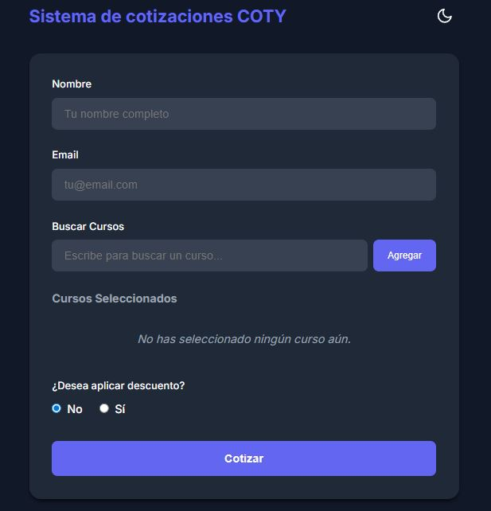
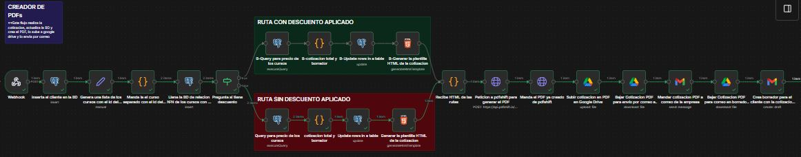
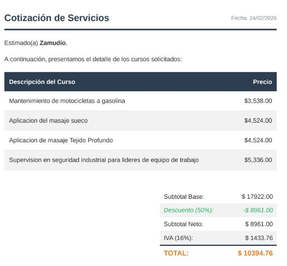

# Flujo para automatizar cotizaciones
Flujo de N8N para crear PDF de cotiaziones, guardarlas en una BD y en google drive, mandarla al correo de la empresa y crea un borrador para el cliente
Toma la información de la base de datos al webhook y el webhook manda información al flujo principal para la generación de la cotización.

Es un producto escalable y adaptable a cualquier necesidad

front page

flujo principal

PDF generado
